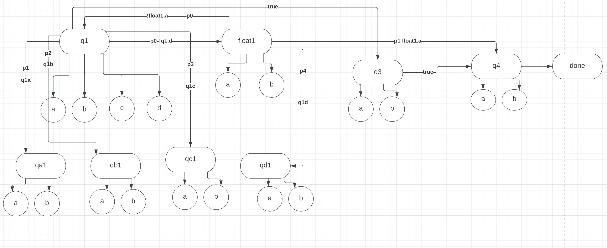

### DIA:
An custom graph traversal implementation based on user configuration. It is a directed weighted graph where edges hold the information of boolean condition and priority, which should be configured by user to define the path.



To run it in local make sure `vite` is installed.

```
npm install
npm run dev
```